# Multi-Threaded Car Racing Simulation Architecture

## 1. System Overview

The car racing simulation will be a C++ standalone desktop application with OpenGL/DirectX rendering, featuring arcade-style physics with exaggerated handling that still requires skill. It will support up to 20 concurrent vehicles and implement basic weather effects like rain and snow that affect handling and visibility.

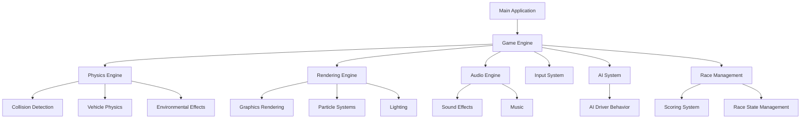

## 2. Thread Architecture

The system will utilize multiple threads to handle different aspects of the simulation:

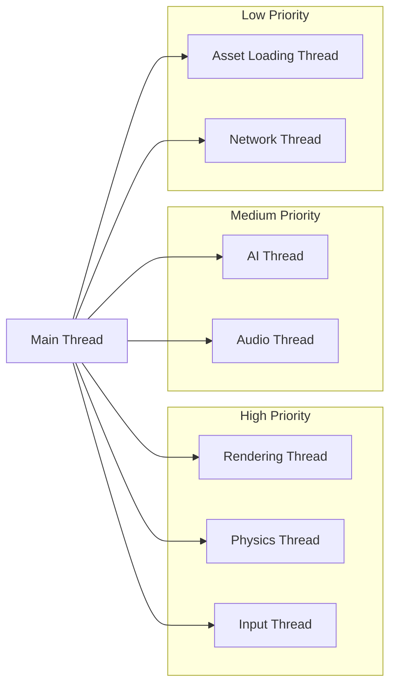

### Thread Responsibilities:

1. **Main Thread**:
   - Game loop coordination
   - Thread synchronization
   - State management
   - UI rendering

2. **Rendering Thread**:
   - OpenGL/DirectX rendering
   - Scene graph management
   - Shader processing
   - Frame buffering

3. **Physics Thread**:
   - Vehicle physics simulation
   - Collision detection and resolution
   - Environmental physics (weather effects)
   - Track physics

4. **AI Thread**:
   - AI driver behavior computation
   - Pathfinding
   - Decision making
   - Difficulty scaling

5. **Audio Thread**:
   - Sound effect processing
   - Music playback
   - 3D audio positioning
   - Audio mixing

6. **Input Thread**:
   - Controller/keyboard/mouse input processing
   - Input mapping
   - Force feedback (if applicable)

7. **Asset Loading Thread**:
   - Dynamic resource loading
   - Texture streaming
   - Model loading

8. **Network Thread** (optional for future multiplayer):
   - Packet sending/receiving
   - State synchronization
   - Latency compensation

## 3. Data Flow and Synchronization

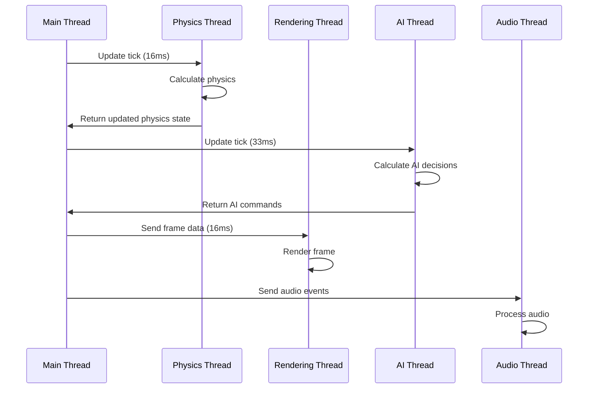

### Synchronization Mechanisms:

1. **Thread-Safe Queues**:
   - Command queues for inter-thread communication
   - Double-buffered state for rendering

2. **Mutex Locks**:
   - Fine-grained locks for shared resources
   - Read-write locks for state data

3. **Atomic Operations**:
   - For simple counters and flags
   - Lock-free algorithms where possible

4. **Barriers**:
   - Synchronization points between physics and rendering

5. **Condition Variables**:
   - For thread signaling and coordination

## 4. Component Architecture

### 4.1 Physics System

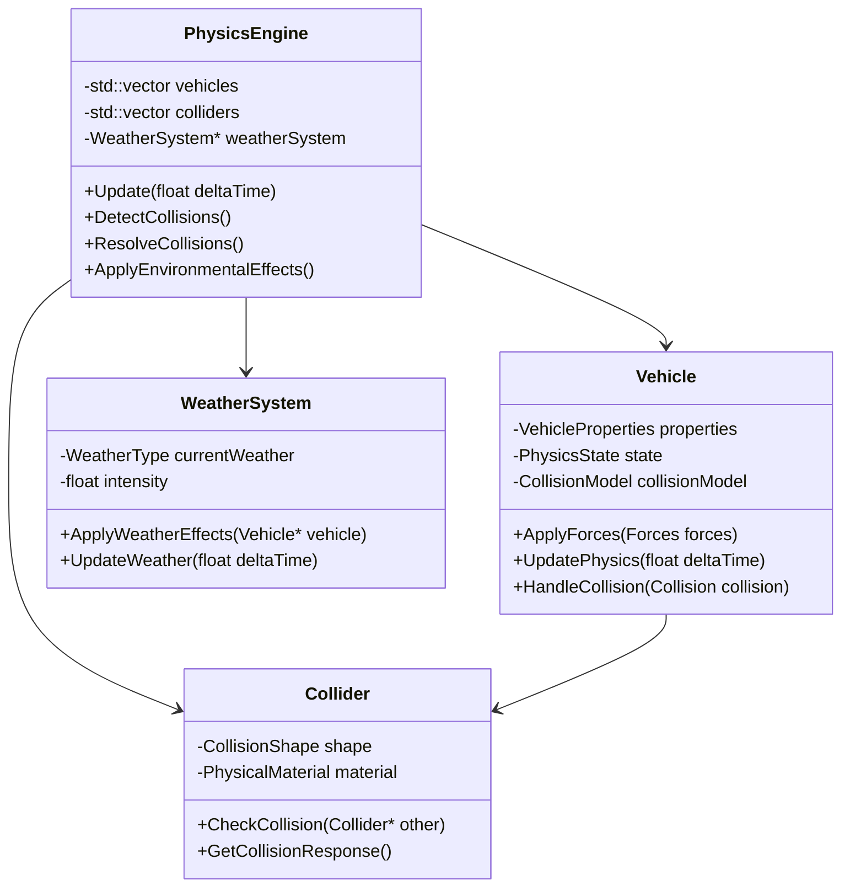

The physics system will use a simplified model for arcade-style physics:
- Basic rigid body dynamics
- Simplified tire models with exaggerated grip
- Arcade-style drifting mechanics
- Simplified aerodynamics
- Collision detection using bounding volumes hierarchy (BVH)

### 4.2 Rendering System

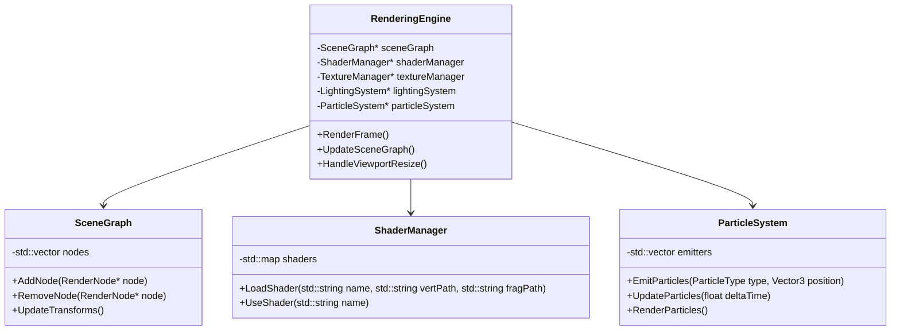

The rendering system will focus on:
- Efficient batching for multiple vehicles
- Level of detail (LOD) for distant objects
- Particle effects for weather, tire smoke, etc.
- Post-processing for visual effects (motion blur, etc.)
- Optimized culling techniques

### 4.3 AI System

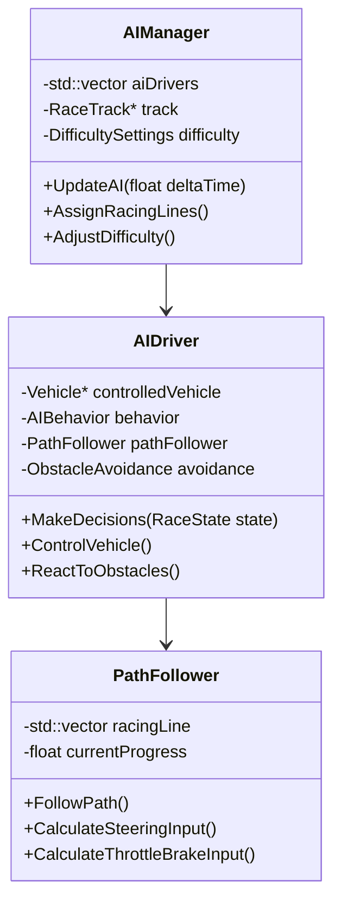

The AI system will implement:
- Racing line following
- Dynamic obstacle avoidance
- Rubber-banding for balanced competition
- Different AI personalities and driving styles
- Adaptive difficulty based on player performance

### 4.4 Race Management System

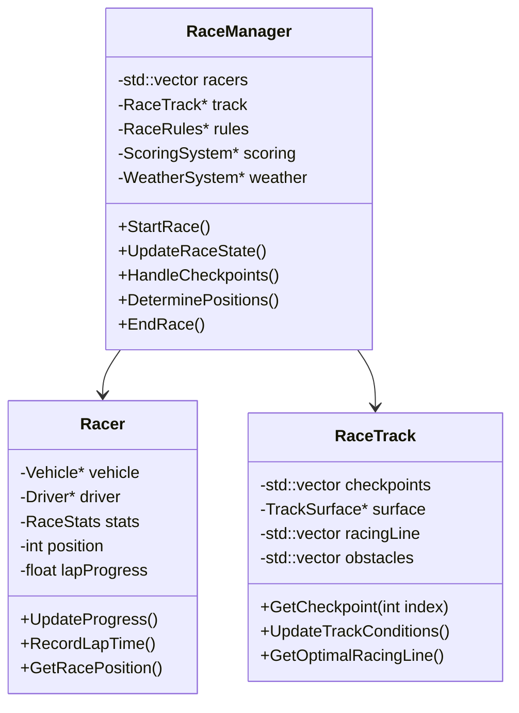

The race management system will handle:
- Race start/finish logic
- Lap counting and timing
- Position determination
- Checkpoint validation
- Race rules enforcement
- Dynamic track conditions

## 5. Thread-Safe Data Structures

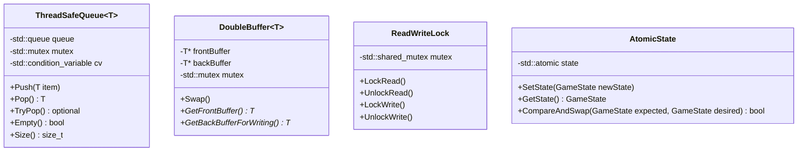

These thread-safe data structures will be used throughout the system to ensure safe concurrent access to shared data.

## 6. Resource Management

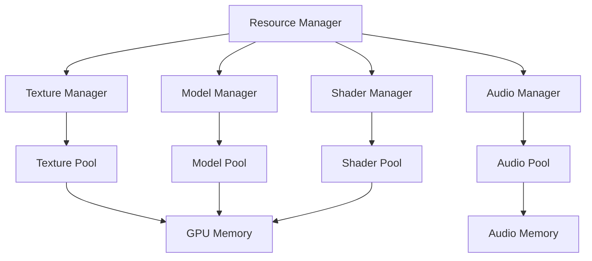

The resource management system will:
- Implement resource pooling to minimize allocation/deallocation
- Use streaming for large assets
- Prioritize resources based on visibility and importance
- Implement level of detail (LOD) for models and textures
- Use memory budgets for different resource types

## 7. Performance Considerations

### 7.1 Thread Scheduling and Priorities

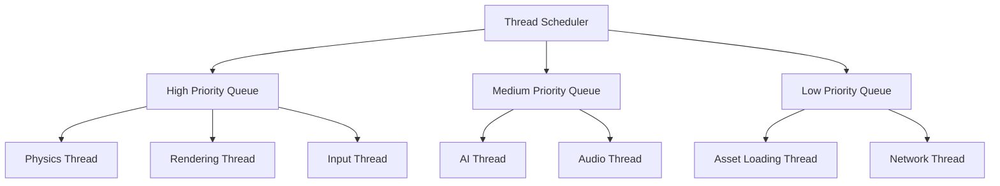

- Physics and rendering threads will have the highest priority
- AI and audio threads will have medium priority
- Asset loading and network threads will have lower priority
- Thread affinity will be used to distribute work across CPU cores

### 7.2 Load Balancing

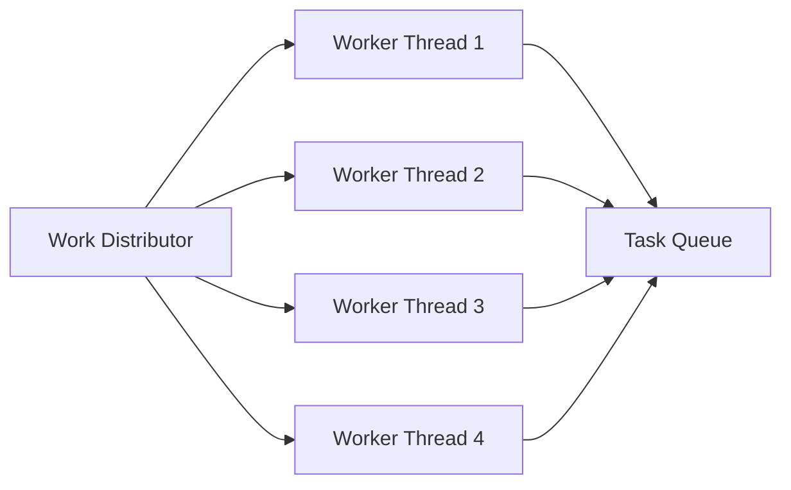

- Physics calculations will be distributed across worker threads
- AI computations for different vehicles will be parallelized
- Particle systems will use compute shaders where available
- Dynamic load balancing based on CPU core availability

### 7.3 Memory Management

- Custom memory allocators for different subsystems
- Object pooling for frequently created/destroyed objects
- SIMD optimizations for physics calculations
- Cache-friendly data layouts
- Minimizing cache misses through data locality

## 8. Scalability

The architecture is designed to scale across multiple CPU cores:

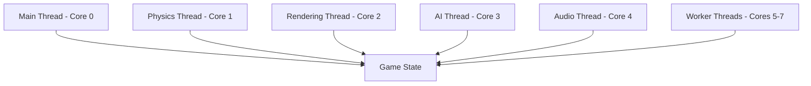

- The system will detect available cores and scale accordingly
- Work will be distributed to maximize core utilization
- Critical paths will be optimized to minimize thread synchronization
- The architecture supports scaling from 4 to 16+ cores

## 9. Collision Detection and Resolution

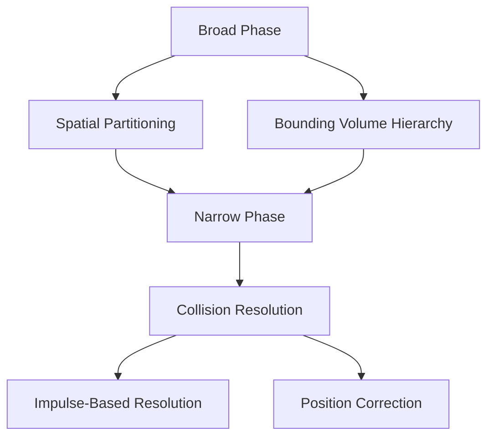

- Broad phase using spatial partitioning (grid or quadtree)
- Narrow phase using simplified collision shapes
- Collision resolution with arcade-style physics responses
- Thread-safe collision detection using job system

## 10. Weather and Environmental Effects

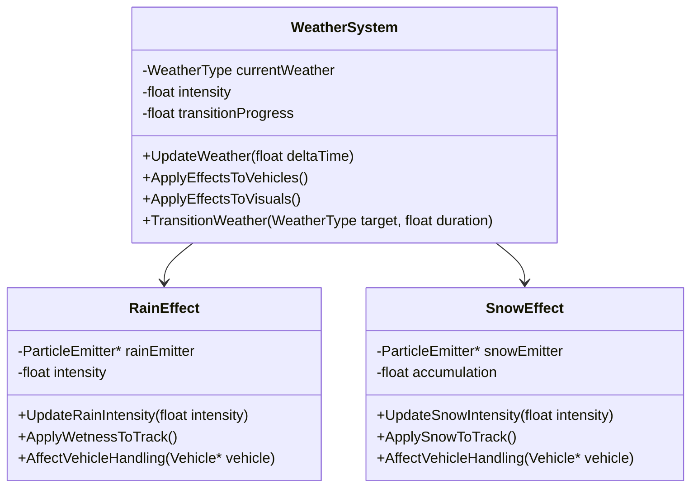

- Dynamic weather transitions
- Weather effects on vehicle handling
- Visual effects for different weather conditions
- Track surface condition changes

## 11. Implementation Plan

### Phase 1: Core Systems
1. Set up multi-threaded architecture
2. Implement basic physics engine
3. Create rendering pipeline
4. Develop thread synchronization mechanisms
5. Implement resource management

### Phase 2: Vehicle and Track
1. Implement vehicle physics
2. Create track system
3. Develop collision detection
4. Implement basic AI
5. Add input handling

### Phase 3: Race Features
1. Implement race management
2. Add scoring system
3. Develop weather effects
4. Create particle systems
5. Implement audio

### Phase 4: Optimization and Polish
1. Optimize thread performance
2. Implement advanced AI behaviors
3. Add visual effects
4. Polish physics and handling
5. Optimize for different hardware configurations

## 12. Technical Challenges and Solutions

### Challenge 1: Thread Synchronization
**Solution**: Use a combination of double buffering, atomic operations, and fine-grained locks to minimize contention.

### Challenge 2: Physics Performance
**Solution**: Implement simplified physics models optimized for arcade-style gameplay, using SIMD instructions and parallel computation.

### Challenge 3: Rendering Performance
**Solution**: Use frustum culling, LOD, and efficient batching to maximize rendering performance.

### Challenge 4: AI Computation
**Solution**: Distribute AI calculations across frames and use simplified decision-making for distant vehicles.

### Challenge 5: Memory Management
**Solution**: Implement custom allocators and object pooling to minimize allocation overhead.

## 13. Conclusion

This architecture provides a robust foundation for a multi-threaded car racing simulation with arcade-style physics. The system is designed to:

- Efficiently utilize multiple CPU cores
- Provide responsive gameplay with minimal latency
- Support up to 20 vehicles with realistic behavior
- Implement weather effects that impact gameplay
- Maintain consistent frame rates through optimized resource usage
- Prevent race conditions through careful thread synchronization

The modular design allows for future expansion and optimization, while the thread architecture ensures that critical systems like physics and rendering receive priority processing.

## 14. Advanced AI System Architecture

### 14.1 AI Driver Behavior Model

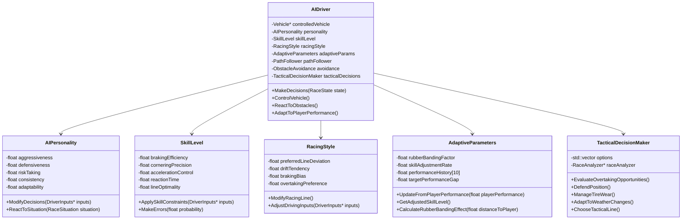

### 14.2 AI Fairness and Challenge System

The AI system is designed to create challenging but fair opponents through several key mechanisms:

#### 14.2.1 Dynamic Difficulty Adjustment

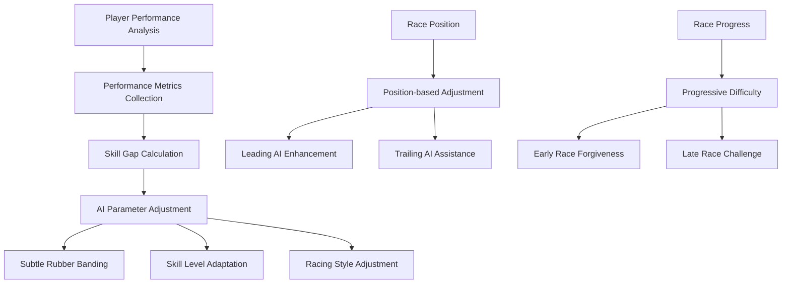

The system continuously monitors player performance using metrics such as:
- Lap times
- Corner execution
- Racing line adherence
- Recovery from mistakes
- Overall race position

Based on these metrics, the AI system dynamically adjusts:
1. **Skill parameters**: Braking points, cornering speed, acceleration control
2. **Rubber banding**: Subtle speed adjustments based on distance to player
3. **Error frequency**: Introducing realistic mistakes to maintain challenge

The adjustments are designed to be:
- **Subtle**: Changes are gradual and not immediately obvious
- **Realistic**: AI behavior remains believable and consistent with their personality
- **Fair**: Assistance is limited to prevent obvious cheating

#### 14.2.2 AI Personality System

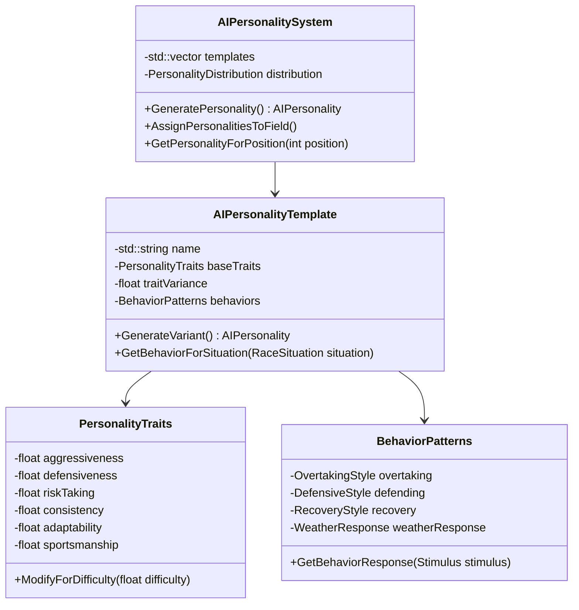

The AI Personality System creates diverse and memorable opponents:

1. **Personality Templates**:
   - **The Aggressive Charger**: Takes risks, aggressive overtaking, prone to mistakes
   - **The Defensive Tactician**: Careful, precise, difficult to pass
   - **The Consistent Performer**: Reliable lap times, few mistakes
   - **The Comeback Specialist**: Performs better when behind
   - **The Weather Expert**: Excels in changing conditions
   - **The Front-Runner**: Performs best when leading

2. **Personality Distribution**:
   - Each race features a mix of personalities
   - Higher difficulty levels include more challenging personalities
   - Personalities are distributed to create interesting race dynamics

3. **Behavioral Consistency**:
   - AI drivers maintain consistent personality traits across races
   - Players can learn and anticipate opponent behaviors
   - Creates recognizable "rivals" with distinctive driving styles

#### 14.2.3 Racing Line and Pathfinding System

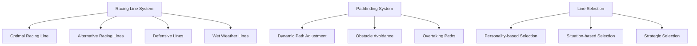

The racing line system provides multiple valid racing lines:

1. **Multiple Valid Paths**:
   - Optimal racing line for fastest lap times
   - Defensive lines to prevent overtaking
   - Alternative lines for overtaking opportunities
   - Weather-specific lines for rain/snow conditions

2. **Dynamic Path Selection**:
   - AI selects appropriate lines based on race situation
   - Personality influences line preference
   - Strategic considerations affect line choice

3. **Realistic Execution**:
   - Skill level affects ability to follow intended line
   - Introduces realistic variations and mistakes
   - Higher difficulty AI follows optimal lines more precisely

#### 14.2.4 Tactical Decision Making

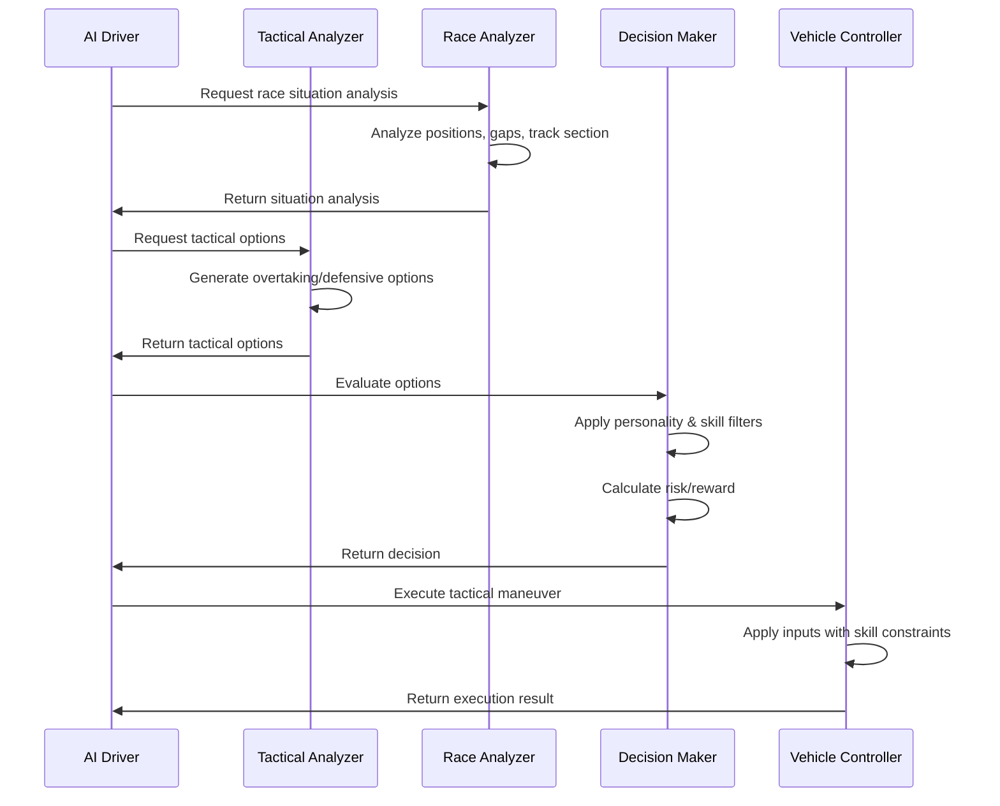

The tactical decision-making system enables AI drivers to:

1. **Analyze Race Situations**:
   - Identify overtaking opportunities
   - Recognize defensive requirements
   - Evaluate risk vs. reward
   - Consider track conditions and weather

2. **Make Strategic Decisions**:
   - When to overtake vs. when to follow
   - How aggressively to defend position
   - When to take risks vs. when to drive conservatively
   - How to adapt to changing conditions

3. **Execute Realistic Maneuvers**:
   - Skill-appropriate overtaking moves
   - Defensive driving techniques
   - Recovery from mistakes
   - Adapting to unexpected situations

#### 14.2.5 Fairness Enforcement System

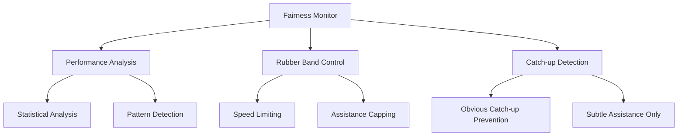

The fairness enforcement system ensures AI remains challenging but fair:

1. **Performance Monitoring**:
   - Tracks AI performance relative to player
   - Identifies statistical anomalies
   - Prevents unrealistic performance spikes

2. **Rubber Band Limitations**:
   - Caps maximum assistance for trailing AI
   - Limits performance penalties for leading AI
   - Ensures assistance is subtle and realistic

3. **Fairness Rules**:
   - No "teleporting" or impossible physics
   - No immunity to physics or track conditions
   - Same basic vehicle capabilities as player
   - Mistakes must be realistic and recoverable

#### 14.2.6 AI Difficulty Levels

The system supports multiple difficulty levels that affect:

1. **Skill Parameters**:
   - Braking efficiency and points
   - Cornering speed and precision
   - Acceleration control
   - Racing line adherence

2. **Error Frequency**:
   - Frequency of minor mistakes
   - Probability of major errors
   - Recovery efficiency

3. **Tactical Intelligence**:
   - Awareness of overtaking opportunities
   - Defensive capabilities
   - Strategic decision making

4. **Adaptability**:
   - Response to changing conditions
   - Ability to find alternative lines
   - Recovery from unexpected situations

### 14.3 Implementation Approach

The AI system will be implemented with these technical considerations:

1. **Computational Efficiency**:
   - AI calculations distributed across multiple frames
   - Level of detail system for AI computation
   - Simplified physics for distant vehicles
   - Prioritized computation for nearby opponents

2. **Thread Management**:
   - AI thread with variable update rate (30-60Hz)
   - Job system for distributing AI workload
   - Priority-based scheduling for critical AI decisions
   - Batch processing for similar AI calculations

3. **Memory Optimization**:
   - Shared racing line data
   - Instanced AI behavior parameters
   - Efficient decision tree representation
   - Cached tactical analysis results

4. **Scalability**:
   - Dynamic AI complexity based on available CPU resources
   - Configurable AI count (8-20 vehicles)
   - Adjustable update frequency
   - LOD system for AI behavior complexity

### 14.4 AI Development and Testing Framework

```mermaid
graph TD
    A[AI Development Framework] --> B[AI Behavior Recording]
    A --> C[Playback System]
    A --> D[Automated Testing]
    A --> E[Performance Analysis]
    
    B --> F[Race Session Recording]
    B --> G[Decision Log]
    
    C --> H[Behavior Replay]
    C --> I[Scenario Testing]
    
    D --> J[Regression Testing]
    D --> K[Performance Benchmarks]
    
    E --> L[CPU Usage Analysis]
    E --> M[Memory Profiling]
```

The AI development framework will include:

1. **Recording and Playback**:
   - Record AI behavior and decisions
   - Replay scenarios for debugging
   - Compare behavior across versions

2. **Automated Testing**:
   - Test AI performance across tracks
   - Verify fairness and challenge
   - Regression testing for AI changes

3. **Analysis Tools**:
   - Visualize racing lines and decisions
   - Analyze performance metrics
   - Identify optimization opportunities